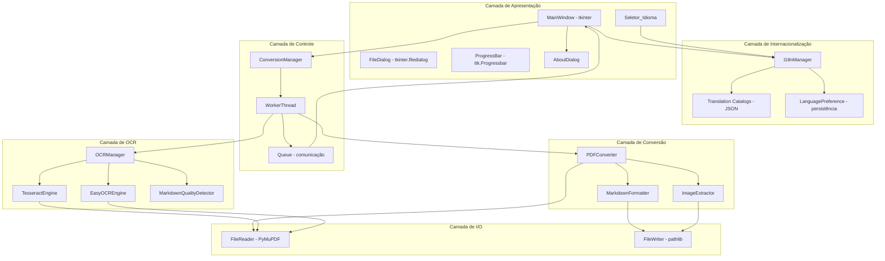
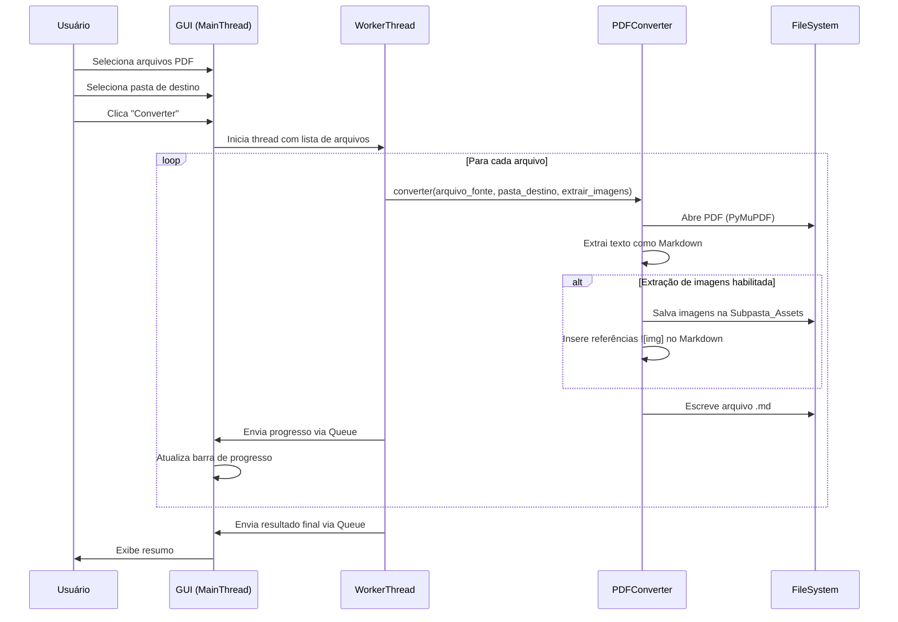
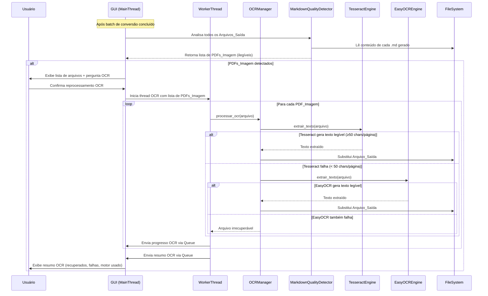

# Design Document

## Overview

Este documento descreve o design técnico da aplicação desktop multiplataforma para conversão em lote de arquivos PDF para Markdown. A aplicação é desenvolvida em Python e roda em Linux e Windows, oferecendo uma interface gráfica simples baseada em tkinter. O motor de conversão utiliza a biblioteca PyMuPDF (via pymupdf4llm) para extração de texto estruturado e imagens embutidas, com suporte a tabelas, hierarquia de títulos e referências de imagem no Markdown gerado.

A aplicação inclui fallback OCR para PDFs baseados em imagem (usando Tesseract como motor primário e EasyOCR como secundário), internacionalização completa (Português BR e Inglês) com troca ao vivo de idioma, e uma tela Sobre com informações do desenvolvedor e licenciamento MIT.

### Decisões de Design

| Decisão | Escolha | Justificativa |
|---------|---------|---------------|
| Framework GUI | tkinter | Vem incluso na biblioteca padrão do Python, suporta diálogos nativos de arquivo/pasta via `tkinter.filedialog`, leve e sem dependências externas de compilação |
| Motor de conversão PDF | PyMuPDF (fitz) + pymupdf4llm | Alta performance, suporta extração de texto em Markdown, extração de imagens, detecção de tabelas, multiplataforma sem dependências de sistema |
| Threading | `threading.Thread` + `queue.Queue` | Mantém a GUI responsiva durante conversões longas, comunicação segura entre threads via fila |
| Gerenciamento de caminhos | `pathlib.Path` | API moderna, resolve separadores de caminho automaticamente por plataforma, suporta Unicode |
| Codificação de saída | UTF-8 com LF | Conforme requisito 6.4, consistente em ambos os SOs |
| OCR primário | Tesseract (pytesseract) | Motor OCR maduro, open-source, suporta múltiplos idiomas, amplamente disponível em repositórios de ambos os SOs |
| OCR secundário | EasyOCR | Motor baseado em deep learning, complementar ao Tesseract, melhor em documentos com fontes degradadas ou layouts complexos |
| Internacionalização | Dicionários JSON + classe I18nManager | Solução leve sem dependência externa, troca de idioma ao vivo sem reinício, persistência via arquivo local |
| Persistência de preferências | JSON em diretório `~/.config/pdfconverter/` (Linux) / `%APPDATA%/pdfconverter/` (Windows) | Padrão de cada plataforma para configurações de aplicação |

## Architecture

A aplicação segue uma arquitetura em camadas com separação clara entre GUI, lógica de negócio e I/O:



### Fluxo de Dados



### Fluxo de OCR Fallback



## Components and Interfaces

### 1. MainWindow (GUI Principal)

Janela principal da aplicação com todos os widgets de interação.

```python
class MainWindow:
    """Janela principal da aplicação."""

    def __init__(self, root: tk.Tk) -> None: ...

    def select_files(self) -> None:
        """Abre diálogo nativo para seleção de PDFs."""
        ...

    def select_output_folder(self) -> None:
        """Abre diálogo nativo para seleção da pasta de destino."""
        ...

    def remove_selected_file(self) -> None:
        """Remove arquivo selecionado da lista."""
        ...

    def start_conversion(self) -> None:
        """Valida pré-condições e inicia a conversão em thread separada."""
        ...

    def update_progress(self, current: int, total: int, filename: str) -> None:
        """Atualiza barra de progresso e nome do arquivo atual."""
        ...

    def show_summary(self, result: ConversionResult) -> None:
        """Exibe resumo final da conversão."""
        ...
```

### 2. ConversionManager

Orquestra o processo de conversão e gerencia a thread de trabalho.

```python
class ConversionManager:
    """Gerencia o ciclo de vida da conversão em batch."""

    def __init__(self, progress_queue: queue.Queue) -> None: ...

    def start(
        self,
        files: list[Path],
        output_dir: Path,
        extract_images: bool
    ) -> threading.Thread:
        """Inicia a conversão em uma thread separada."""
        ...

    def _worker(
        self,
        files: list[Path],
        output_dir: Path,
        extract_images: bool
    ) -> None:
        """Função executada na thread de trabalho."""
        ...
```

### 3. PDFConverter

Módulo central que realiza a conversão de um único PDF para Markdown.

```python
class PDFConverter:
    """Converte um arquivo PDF individual para Markdown."""

    def convert(
        self,
        source: Path,
        output_dir: Path,
        extract_images: bool
    ) -> ConversionFileResult:
        """
        Converte um PDF para Markdown.

        Retorna resultado com status, caminho de saída e erros.
        """
        ...

    def _extract_markdown(self, doc: fitz.Document) -> str:
        """Extrai conteúdo do PDF como texto Markdown usando pymupdf4llm."""
        ...

    def _extract_images(
        self,
        doc: fitz.Document,
        assets_dir: Path
    ) -> list[ImageInfo]:
        """Extrai imagens embutidas e salva na pasta de assets."""
        ...

    def _insert_image_references(
        self,
        markdown: str,
        images: list[ImageInfo],
        assets_dir_name: str
    ) -> str:
        """Insere referências de imagem no Markdown gerado."""
        ...
```

### 4. PDFValidator

Valida se um arquivo é um PDF legível e não-protegido.

```python
class PDFValidator:
    """Valida arquivos PDF antes da conversão."""

    @staticmethod
    def validate(file_path: Path) -> ValidationResult:
        """
        Verifica se o arquivo é um PDF válido.

        Retorna ValidationResult com is_valid e motivo de rejeição.
        """
        ...
```

### 5. FileListManager

Gerencia a lista de arquivos selecionados (sem duplicatas, com validação).

```python
class FileListManager:
    """Gerencia a lista de arquivos PDF selecionados."""

    MAX_FILES = 50

    def __init__(self) -> None:
        self._files: list[Path] = []

    def add_files(self, files: list[Path]) -> AddFilesResult:
        """
        Adiciona arquivos à lista, rejeitando duplicatas e inválidos.

        Retorna resultado com arquivos aceitos e rejeitados.
        """
        ...

    def remove_file(self, file_path: Path) -> None:
        """Remove um arquivo da lista."""
        ...

    def clear(self) -> None:
        """Limpa toda a lista."""
        ...

    @property
    def files(self) -> list[Path]:
        """Retorna cópia da lista de arquivos."""
        ...

    @property
    def count(self) -> int:
        """Retorna quantidade de arquivos na lista."""
        ...
```

### 6. OCRManager

Orquestra o processo de fallback OCR com múltiplos motores.

```python
class OCRManager:
    """Gerencia o fallback OCR com motores primário e secundário."""

    LEGIBILITY_THRESHOLD = 50  # mínimo de caracteres alfanuméricos por página

    def __init__(
        self,
        primary_engine: OCREngine,
        secondary_engine: OCREngine,
        progress_queue: queue.Queue
    ) -> None: ...

    def process_batch(
        self,
        ocr_candidates: list[OCRCandidate],
        output_dir: Path
    ) -> OCRBatchResult:
        """
        Processa batch de PDFs com OCR fallback.

        Tenta motor primário primeiro; se falhar, tenta secundário.
        """
        ...

    def _process_single(
        self,
        candidate: OCRCandidate,
        output_dir: Path
    ) -> OCRFileResult:
        """Processa um único arquivo com fallback entre motores."""
        ...
```

### 7. OCREngine (Interface)

Interface abstrata para motores OCR.

```python
from abc import ABC, abstractmethod


class OCREngine(ABC):
    """Interface abstrata para um motor OCR."""

    @property
    @abstractmethod
    def name(self) -> str:
        """Nome identificador do motor (ex: 'Tesseract', 'EasyOCR')."""
        ...

    @abstractmethod
    def extract_text(self, pdf_path: Path) -> str:
        """
        Extrai texto de um PDF usando OCR.

        Retorna o texto extraído (pode ser vazio se falhar).
        """
        ...


class TesseractEngine(OCREngine):
    """Motor OCR baseado em Tesseract (pytesseract)."""

    @property
    def name(self) -> str:
        return "Tesseract"

    def extract_text(self, pdf_path: Path) -> str:
        """Extrai texto usando pytesseract + pdf2image."""
        ...


class EasyOCREngine(OCREngine):
    """Motor OCR baseado em EasyOCR."""

    @property
    def name(self) -> str:
        return "EasyOCR"

    def extract_text(self, pdf_path: Path) -> str:
        """Extrai texto usando easyocr."""
        ...
```

### 8. MarkdownQualityDetector

Detecta Markdown ilegível gerado a partir de PDFs baseados em imagem.

```python
class MarkdownQualityDetector:
    """Detecta Arquivos_Saída que produziram Markdown ilegível."""

    CHARS_PER_PAGE_THRESHOLD = 50

    @staticmethod
    def is_illegible(markdown_content: str, page_count: int) -> bool:
        """
        Verifica se o conteúdo Markdown é ilegível.

        Retorna True se o conteúdo tiver menos de 50 caracteres
        alfanuméricos por página em média.
        """
        ...

    def detect_ocr_candidates(
        self,
        results: list[ConversionFileResult]
    ) -> list[OCRCandidate]:
        """
        Analisa resultados da conversão e identifica candidatos a OCR.

        Lê cada Arquivo_Saída e verifica legibilidade.
        """
        ...
```

### 9. AboutDialog

Diálogo Sobre com informações do autor e licenciamento.

```python
class AboutDialog:
    """Diálogo 'Sobre' da aplicação."""

    AUTHOR = "William Mendes"
    GITHUB_URL = "http://github.com/wcmendes"
    LATTES_URL = "https://lattes.cnpq.br/7726054867638395"

    def __init__(self, parent: tk.Tk, i18n: "I18nManager") -> None: ...

    def show(self) -> None:
        """Exibe o diálogo Sobre como janela modal."""
        ...

    def _open_link(self, url: str) -> None:
        """Abre URL no navegador padrão do sistema."""
        ...
```

### 10. I18nManager

Gerencia internacionalização com troca ao vivo de idioma.

```python
from enum import Enum


class Locale(Enum):
    """Idiomas suportados pela aplicação."""
    PT_BR = "pt-br"
    EN = "en"


class I18nManager:
    """Gerencia traduções e preferência de idioma."""

    DEFAULT_LOCALE = Locale.PT_BR

    def __init__(self, config_dir: Path | None = None) -> None:
        """
        Inicializa o gerenciador de i18n.

        Carrega catálogos de tradução e restaura preferência salva.
        Se nenhuma preferência existir, usa PT_BR como padrão.
        """
        ...

    @property
    def current_locale(self) -> Locale:
        """Retorna o idioma atualmente ativo."""
        ...

    def set_locale(self, locale: Locale) -> None:
        """
        Altera o idioma e persiste a preferência.

        Notifica listeners registrados para atualizar a GUI.
        """
        ...

    def t(self, key: str) -> str:
        """
        Traduz uma chave para o idioma atual.

        Retorna a string traduzida ou a própria chave se não encontrada.
        """
        ...

    def register_listener(self, callback: Callable[[], None]) -> None:
        """Registra callback para ser notificado na troca de idioma."""
        ...

    def _load_catalogs(self) -> dict[Locale, dict[str, str]]:
        """Carrega catálogos JSON de tradução do diretório de recursos."""
        ...

    def _save_preference(self, locale: Locale) -> None:
        """Persiste preferência de idioma no diretório de configuração."""
        ...

    def _load_preference(self) -> Locale | None:
        """Carrega preferência de idioma salva. Retorna None se não existir."""
        ...
```

## Data Models

```python
from dataclasses import dataclass, field
from enum import Enum
from pathlib import Path


class ConversionStatus(Enum):
    """Status possíveis para a conversão de um arquivo."""
    SUCCESS = "success"
    FAILED_CORRUPTED = "failed_corrupted"
    FAILED_PASSWORD = "failed_password"
    FAILED_NO_TEXT = "failed_no_text"
    FAILED_IO_ERROR = "failed_io_error"


@dataclass
class ValidationResult:
    """Resultado da validação de um arquivo PDF."""
    is_valid: bool
    reason: str = ""


@dataclass
class ImageInfo:
    """Informações sobre uma imagem extraída."""
    filename: str          # ex: "img_001.png"
    format: str            # ex: "png", "jpeg"
    page_number: int       # página onde a imagem aparece
    position_index: int    # ordem na página


@dataclass
class ConversionFileResult:
    """Resultado da conversão de um único arquivo."""
    source: Path
    output: Path | None
    status: ConversionStatus
    error_message: str = ""
    images_extracted: int = 0


@dataclass
class AddFilesResult:
    """Resultado da adição de arquivos à lista."""
    accepted: list[Path] = field(default_factory=list)
    rejected_invalid: list[tuple[Path, str]] = field(default_factory=list)
    rejected_duplicate: list[Path] = field(default_factory=list)
    rejected_limit: list[Path] = field(default_factory=list)


@dataclass
class ConversionResult:
    """Resultado geral de uma operação de conversão em batch."""
    total: int
    succeeded: int
    failed: int
    results: list[ConversionFileResult] = field(default_factory=list)


@dataclass
class ProgressUpdate:
    """Mensagem de progresso enviada da thread de trabalho para a GUI."""
    current_index: int
    total: int
    current_filename: str
    is_complete: bool = False
    result: ConversionResult | None = None


class OCREngineUsed(Enum):
    """Motor OCR utilizado na extração."""
    TESSERACT = "tesseract"
    EASYOCR = "easyocr"
    NONE = "none"


class OCRStatus(Enum):
    """Status do processamento OCR de um arquivo."""
    SUCCESS = "success"
    FAILED_ALL_ENGINES = "failed_all_engines"
    SKIPPED_BY_USER = "skipped_by_user"


@dataclass
class OCRCandidate:
    """Arquivo identificado como PDF_Imagem candidato a OCR."""
    source_pdf: Path
    output_md: Path
    page_count: int
    alphanumeric_count: int  # total de chars alfanuméricos no .md gerado


@dataclass
class OCRFileResult:
    """Resultado do processamento OCR de um único arquivo."""
    source_pdf: Path
    output_md: Path
    status: OCRStatus
    engine_used: OCREngineUsed
    error_message: str = ""


@dataclass
class OCRBatchResult:
    """Resultado geral do processamento OCR em batch."""
    total: int
    recovered: int
    failed: int
    results: list[OCRFileResult] = field(default_factory=list)


@dataclass
class LanguagePreference:
    """Preferência de idioma persistida localmente."""
    locale: str  # "pt-br" ou "en"
    saved_at: str = ""  # ISO timestamp da última alteração
```

## Correctness Properties

*Uma propriedade é uma característica ou comportamento que deve ser verdadeiro em todas as execuções válidas de um sistema — essencialmente, uma afirmação formal sobre o que o sistema deve fazer. Propriedades servem como ponte entre especificações legíveis por humanos e garantias de corretude verificáveis por máquina.*

### Property 1: Invariantes do FileListManager

*For any* sequência de operações de adição e remoção de arquivos no FileListManager, a lista resultante SHALL conter no máximo 50 itens, não conter duplicatas (dois itens com o mesmo caminho), e não conter nenhum arquivo inválido (não-PDF ou corrompido).

**Validates: Requirements 1.2, 1.3, 1.5, 1.6**

### Property 2: Transformação de nome PDF para Markdown

*For any* caminho de arquivo com extensão `.pdf`, o nome do Arquivo_Saída gerado SHALL ser idêntico ao nome do Arquivo_Fonte com a extensão substituída por `.md`.

**Validates: Requirements 3.2**

### Property 3: Invariante de conversão em batch

*For any* lista de N arquivos processados pelo ConversionManager, o resultado SHALL satisfazer `succeeded + failed == total == N`, e a falha de qualquer arquivo individual SHALL não impedir o processamento dos demais.

**Validates: Requirements 3.5, 3.7, 5.3, 5.4**

### Property 4: Consistência de progresso

*For any* batch de N arquivos, o ConversionManager SHALL emitir exatamente N mensagens de ProgressUpdate, onde cada mensagem tem `current_index` monotonicamente crescente de 1 a N e a última mensagem tem `is_complete == True`.

**Validates: Requirements 3.1, 5.1**

### Property 5: Nome da Subpasta de Assets

*For any* arquivo PDF com nome base `X` (sem extensão), a Subpasta_Assets criada SHALL ter o nome `X_assets`.

**Validates: Requirements 4.3**

### Property 6: Nomenclatura sequencial de imagens

*For any* conjunto de N imagens extraídas de um PDF (1 ≤ N ≤ 999), os nomes dos arquivos SHALL seguir o padrão `img_XXX.{formato}` com XXX sendo número sequencial de 3 dígitos com zero-padding (img_001, img_002, ..., img_N), e o formato SHALL corresponder ao formato original da imagem.

**Validates: Requirements 4.4**

### Property 7: Referências de imagem no Markdown

*For any* PDF com N imagens extraídas com extração habilitada, o Markdown gerado SHALL conter exatamente N referências no formato `` onde cada caminho aponta para o arquivo correspondente na Subpasta_Assets.

**Validates: Requirements 4.5**

### Property 8: Sem artefatos de imagem quando extração desabilitada

*For any* PDF convertido com extração de imagens desabilitada, o Markdown gerado SHALL não conter referências de imagem no formato `` e nenhuma Subpasta_Assets SHALL ser criada no sistema de arquivos.

**Validates: Requirements 4.6**

### Property 9: Subpasta não criada para PDFs sem imagens

*For any* PDF que não contém objetos embutidos extraíveis, mesmo com extração habilitada, a conversão SHALL gerar o Arquivo_Saída normalmente sem criar a Subpasta_Assets.

**Validates: Requirements 4.8**

### Property 10: Truncamento de nomes longos no progresso

*For any* nome de arquivo com mais de 60 caracteres, o texto exibido na interface de progresso SHALL ter no máximo 63 caracteres (60 + "..."), e para nomes com 60 caracteres ou menos, o texto SHALL ser exibido sem truncamento.

**Validates: Requirements 5.2**

### Property 11: Codificação e terminadores de saída

*For any* Arquivo_Saída gerado pela aplicação, o conteúdo SHALL estar codificado em UTF-8 e usar exclusivamente terminadores de linha LF (`\n`), independentemente do sistema operacional em execução.

**Validates: Requirements 6.4**

### Property 12: Detecção de Markdown ilegível

*For any* conteúdo Markdown e contagem de páginas, o MarkdownQualityDetector SHALL classificar como ilegível se e somente se o conteúdo tiver menos de 50 caracteres alfanuméricos por página em média. Conteúdos com 50 ou mais caracteres alfanuméricos por página SHALL ser classificados como legíveis.

**Validates: Requirements 8.1**

### Property 13: Cadeia de fallback OCR

*For any* PDF_Imagem processado pelo OCRManager, o motor primário (Tesseract) SHALL ser invocado primeiro. Se o resultado do motor primário tiver menos de 50 caracteres alfanuméricos por página, o motor secundário (EasyOCR) SHALL ser invocado. Se o motor primário gerar resultado legível (≥50 chars/página), o motor secundário SHALL não ser invocado.

**Validates: Requirements 8.4, 8.5**

### Property 14: Falha total de OCR preserva original

*For any* PDF_Imagem onde todos os motores OCR falharem (ambos produzem < 50 chars alfanuméricos por página), o Arquivo_Saída original SHALL permanecer inalterado no sistema de arquivos (mesmo conteúdo byte a byte).

**Validates: Requirements 8.6**

### Property 15: Consistência de progresso OCR

*For any* batch de N PDFs_Imagem processados pelo OCRManager, o sistema SHALL emitir exatamente N mensagens de progresso OCR, com índice monotonicamente crescente de 1 a N.

**Validates: Requirements 8.7**

### Property 16: Completude do resumo OCR

*For any* OCRBatchResult gerado pelo OCRManager, o resultado SHALL satisfazer `recovered + failed == total`, e cada OCRFileResult SHALL conter um engine_used válido (Tesseract, EasyOCR ou None para falhas).

**Validates: Requirements 8.8**

### Property 17: Completude do catálogo de traduções

*For any* chave de tradução registrada no catálogo da aplicação e *for any* locale suportado (PT_BR, EN), a tradução SHALL existir e ser uma string não-vazia.

**Validates: Requirements 10.1, 10.6**

### Property 18: Consistência da troca de idioma ao vivo

*For any* chave de tradução e *for any* locale de destino, após invocar `set_locale(locale)` no I18nManager, chamar `t(key)` SHALL retornar o texto no idioma do locale de destino, e nenhuma chave SHALL retornar texto do locale anterior.

**Validates: Requirements 10.3**

### Property 19: Persistência de preferência de idioma (round-trip)

*For any* locale suportado, salvar a preferência via `_save_preference(locale)` e em seguida carregá-la via `_load_preference()` SHALL retornar o mesmo locale originalmente salvo.

**Validates: Requirements 10.4**

## Error Handling

### Estratégia de Erros por Camada

| Camada | Tipo de Erro | Comportamento |
|--------|-------------|---------------|
| Validação de entrada | Arquivo não-PDF, corrompido | Rejeita na adição à lista, notifica usuário com motivo |
| Validação de destino | Pasta sem permissão de escrita | Bloqueia início da conversão, exibe mensagem |
| Conversão individual | PDF protegido, sem texto, I/O | Registra no resultado, pula para próximo arquivo |
| Extração de imagem | Imagem ilegível, erro de I/O | Insere marcador `[Falha na extração da imagem]` no Markdown, continua |
| Conflito de nome | Arquivo já existe no destino | Pergunta ao usuário (sobrescrever / pular) |
| Thread worker | Exceção não tratada | Captura genérica, registra erro, reporta para GUI via Queue |
| OCR - Motor primário | Tesseract indisponível ou timeout | Loga erro, tenta motor secundário (EasyOCR) |
| OCR - Motor secundário | EasyOCR falha ou indisponível | Loga erro, preserva arquivo original, reporta ao usuário |
| OCR - Ambos falham | Nenhum motor gera texto legível | Mantém Arquivo_Saída original, marca como irrecuperável no resumo |
| i18n - Catálogo ausente | Arquivo JSON de tradução não encontrado | Usa locale padrão (PT_BR), loga warning |
| i18n - Chave ausente | Chave de tradução não encontrada no catálogo | Retorna a própria chave como fallback, loga warning |
| Preferência - I/O | Erro ao ler/escrever arquivo de preferência | Usa padrão (PT_BR), não impede operação da aplicação |

### Tratamento de Erros na Conversão

```python
# Pseudo-código do fluxo de erro na conversão
for source_file in file_list:
    try:
        result = converter.convert(source_file, output_dir, extract_images)
        results.append(result)
    except PasswordProtectedError:
        results.append(ConversionFileResult(
            source=source_file,
            output=None,
            status=ConversionStatus.FAILED_PASSWORD,
            error_message="Arquivo protegido por senha"
        ))
    except CorruptedPDFError:
        results.append(ConversionFileResult(
            source=source_file,
            output=None,
            status=ConversionStatus.FAILED_CORRUPTED,
            error_message="Arquivo corrompido ou formato inválido"
        ))
    except Exception as e:
        results.append(ConversionFileResult(
            source=source_file,
            output=None,
            status=ConversionStatus.FAILED_IO_ERROR,
            error_message=str(e)
        ))
    finally:
        progress_queue.put(ProgressUpdate(...))
```

### Tratamento de Erros no OCR Fallback

```python
# Pseudo-código do fluxo de fallback OCR
def _process_single(self, candidate: OCRCandidate, output_dir: Path) -> OCRFileResult:
    # Backup do arquivo original
    original_content = candidate.output_md.read_bytes()

    # Tenta motor primário (Tesseract)
    try:
        text = self.primary_engine.extract_text(candidate.source_pdf)
        if self._is_legible(text, candidate.page_count):
            self._write_markdown(candidate.output_md, text)
            return OCRFileResult(
                source_pdf=candidate.source_pdf,
                output_md=candidate.output_md,
                status=OCRStatus.SUCCESS,
                engine_used=OCREngineUsed.TESSERACT
            )
    except OCREngineError as e:
        logger.warning(f"Tesseract falhou em {candidate.source_pdf}: {e}")

    # Tenta motor secundário (EasyOCR)
    try:
        text = self.secondary_engine.extract_text(candidate.source_pdf)
        if self._is_legible(text, candidate.page_count):
            self._write_markdown(candidate.output_md, text)
            return OCRFileResult(
                source_pdf=candidate.source_pdf,
                output_md=candidate.output_md,
                status=OCRStatus.SUCCESS,
                engine_used=OCREngineUsed.EASYOCR
            )
    except OCREngineError as e:
        logger.warning(f"EasyOCR falhou em {candidate.source_pdf}: {e}")

    # Ambos falharam — restaura original
    candidate.output_md.write_bytes(original_content)
    return OCRFileResult(
        source_pdf=candidate.source_pdf,
        output_md=candidate.output_md,
        status=OCRStatus.FAILED_ALL_ENGINES,
        engine_used=OCREngineUsed.NONE,
        error_message="Nenhum motor OCR conseguiu extrair texto legível"
    )
```

### Princípios

1. **Falha parcial não interrompe o batch**: A conversão de um arquivo nunca impede a dos demais
2. **Feedback claro ao usuário**: Todo erro é comunicado com identificação do arquivo e motivo
3. **Degradação graciosa na extração de imagens**: Falha de uma imagem não impede a extração das demais nem a conversão do texto
4. **Thread segura**: Erros na thread worker são capturados e reportados via Queue, nunca crasham a GUI
5. **OCR é oportunista**: A falha do OCR não é erro crítico — o arquivo original é preservado intacto
6. **Fallback progressivo**: Tesseract falha → EasyOCR tenta → ambos falham → preserva original com notificação
7. **i18n resiliente**: Chaves de tradução ausentes retornam a própria chave, nunca causam crash
8. **Preferências não-bloqueantes**: Falha ao ler/escrever preferências usa valores padrão silenciosamente

## Testing Strategy

### Abordagem Dual: Testes Unitários + Property-Based Testing

A estratégia de testes combina testes unitários para casos específicos e testes baseados em propriedades para verificação ampla de corretude.

### Testes de Propriedade (Property-Based Testing)

**Biblioteca**: [Hypothesis](https://hypothesis.readthedocs.io/) — biblioteca padrão de PBT para Python, madura e amplamente adotada.

**Configuração**:
- Mínimo de 100 iterações por teste de propriedade
- Cada teste referencia a propriedade do design via tag de comentário
- Formato do tag: `# Feature: pdf-to-markdown-converter, Property {N}: {texto}`

**Propriedades testáveis via PBT**:
- Property 1: Invariantes do FileListManager (gerar sequências de operações)
- Property 2: Transformação de nome (gerar nomes de arquivo aleatórios)
- Property 3: Invariante de batch (gerar listas com mock de conversão)
- Property 4: Consistência de progresso (gerar batches de tamanhos variados)
- Property 5: Nome da subpasta (gerar nomes de arquivo)
- Property 6: Nomenclatura de imagens (gerar quantidades de 1 a 999)
- Property 7: Referências de imagem (gerar conjuntos de ImageInfo)
- Property 8: Sem artefatos quando desabilitado (gerar PDFs mock)
- Property 9: Sem subpasta sem imagens (gerar PDFs mock sem imagens)
- Property 10: Truncamento (gerar strings de comprimento variável)
- Property 11: Codificação UTF-8/LF (gerar conteúdo com caracteres Unicode)
- Property 12: Detecção de Markdown ilegível (gerar strings com densidades variáveis de chars alfanuméricos)
- Property 13: Cadeia de fallback OCR (gerar cenários com motores mock que retornam textos de qualidade variável)
- Property 14: Falha total OCR preserva original (gerar cenários com ambos motores falhando)
- Property 15: Consistência de progresso OCR (gerar batches OCR de tamanhos variados)
- Property 16: Completude do resumo OCR (gerar resultados OCR com combinações de sucesso/falha)
- Property 17: Completude do catálogo de traduções (iterar todas as chaves × locales)
- Property 18: Consistência da troca de idioma (gerar sequências de trocas de locale)
- Property 19: Persistência de preferência de idioma (round-trip com locales aleatórios)

### Testes Unitários (Example-Based)

**Biblioteca**: pytest

**Cobertura**:
- Diálogos de seleção de arquivo/pasta (mock de tkinter.filedialog)
- Estados da GUI (botão habilitado/desabilitado, widgets presentes)
- Mensagens de validação (lista vazia, pasta não selecionada)
- Confirmação de sobrescrita de arquivo existente
- Cancelamento de diálogo preserva estado
- Diálogo "Sobre" contém nome do autor, links GitHub e Lattes, versão e ano
- Seletor de idioma presente na janela principal
- Links da Seção_Sobre abrem webbrowser.open com URL correta (mock)
- I18nManager usa PT_BR como padrão quando sem preferência salva
- Usuário recusa OCR → arquivos originais permanecem inalterados
- Lista de PDFs_Imagem detectados é exibida corretamente ao usuário

### Testes de Integração

**Cobertura**:
- Conversão real de PDFs de referência (com títulos, tabelas, listas)
- Extração de imagens de PDFs reais
- Validação de PDFs corrompidos/protegidos com PyMuPDF
- Permissões de arquivo em Linux e Windows
- Responsividade da GUI durante conversão (≤ 500ms)
- OCR real com Tesseract em PDF escaneado de referência
- OCR real com EasyOCR em PDF com texto degradado
- Fallback OCR completo: Tesseract falha → EasyOCR recupera
- Troca de idioma ao vivo atualiza todos os widgets visíveis
- Persistência de preferência de idioma entre sessões (gravar, fechar, reabrir)

### Testes de Smoke

**Cobertura**:
- Arquivo LICENSE existe e contém texto MIT
- README.md e README_EN.md existem e contêm seções obrigatórias
- Tesseract está instalado e acessível no PATH do sistema
- EasyOCR importa sem erros

### Estrutura de Testes

```
tests/
├── unit/
│   ├── test_file_list_manager.py       # Testes unitários e PBT do FileListManager
│   ├── test_pdf_converter.py           # Testes unitários do converter
│   ├── test_naming.py                  # PBT para transformações de nome
│   ├── test_image_extraction.py        # PBT para nomenclatura e referências
│   ├── test_progress.py                # PBT para consistência de progresso
│   ├── test_encoding.py                # PBT para UTF-8/LF
│   ├── test_gui.py                     # Testes unitários dos widgets
│   ├── test_ocr_manager.py             # PBT e unitários do OCRManager
│   ├── test_markdown_quality.py        # PBT para detecção de Markdown ilegível
│   ├── test_i18n_manager.py            # PBT e unitários do I18nManager
│   ├── test_about_dialog.py            # Testes unitários do AboutDialog
│   └── test_language_preference.py     # PBT para persistência de idioma
├── integration/
│   ├── test_pdf_conversion.py          # Conversão de PDFs reais
│   ├── test_image_extraction_real.py   # Extração de imagens reais
│   ├── test_permissions.py             # Testes de permissão do SO
│   ├── test_ocr_tesseract.py           # Integração real com Tesseract
│   ├── test_ocr_easyocr.py            # Integração real com EasyOCR
│   ├── test_ocr_fallback.py            # Fallback completo Tesseract→EasyOCR
│   └── test_i18n_live_switch.py        # Troca de idioma ao vivo na GUI
├── smoke/
│   ├── test_license_exists.py          # Verifica LICENSE MIT
│   ├── test_readme_exists.py           # Verifica README bilíngue
│   └── test_ocr_engines_available.py   # Verifica Tesseract/EasyOCR instalados
└── fixtures/
    ├── sample_simple.pdf               # PDF simples com texto
    ├── sample_tables.pdf               # PDF com tabelas
    ├── sample_images.pdf               # PDF com imagens
    ├── sample_corrupted.pdf            # PDF corrompido
    ├── sample_protected.pdf            # PDF protegido por senha
    ├── sample_scanned.pdf              # PDF escaneado (imagem) para teste OCR
    ├── sample_degraded.pdf             # PDF com texto degradado (EasyOCR melhor)
    └── locales/
        ├── pt-br.json                  # Catálogo de tradução PT-BR para testes
        └── en.json                     # Catálogo de tradução EN para testes
```

